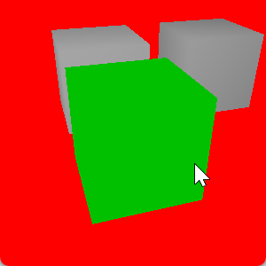
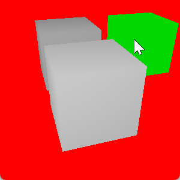
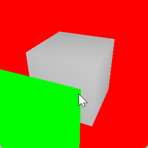
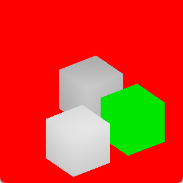
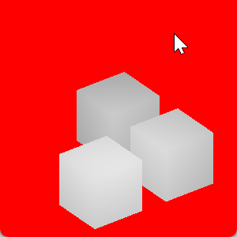

<h1 align="center">📦 Cube Clicking 📦</h1>

A simple LWJGL app that renders some cubes and, if the user clicks one of the cubes, the cube changes its color to green, softly pulsating over time.

The act of trying to figure out what object did you click with your mouse is called "OpenGL mouse picking".

When clicking on the screen...

* We get the mouse cursor coordinates, they are xy values between 0..300, because the window size is 300x300)
* We transform these coordinates into Normalized Device Coordinates (NDC), which is what OpenGL uses, and is a value between -1 and 1
* We invert the projection and the view
* We create two points...
    * A "near" point is where the ray tracing starts
    * A "far" point is where the ray tracing ends
    * I will be honest, I'm still not 100% sure what the near and far points mean, the "near" is where the camera, the far point is ???, I think that the far point means that we are clicking VERY far "after" the screen
* We then convert these two points into world coordinates by multiplying them by the inverse projection and the inverse view
* We then normalize the points
* And then we attempt to raytrace any AABB that intersects our ray!

You can rotate the camera using `A` and `D`, and you can change the projection from perspective to orthographic using `W`.

There are two raytracing implementations in the code: One that's shamelessly stolen from ChatGPT, and another that's based on [zacharmarz's raytracing implementation](https://gamedev.stackexchange.com/a/18459/160509).

By default, the code uses ChatGPT's implementation, but I think that zacharmarz's implementation is easier to understand, but I also think that ChatGPT's implementation is more performant, and ChatGPT's implementation is similar to CraftBukkit's raytracing implementation.

And there's also a simple objects far from the camera are darker shader, fun!